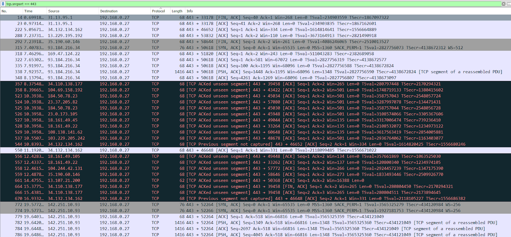
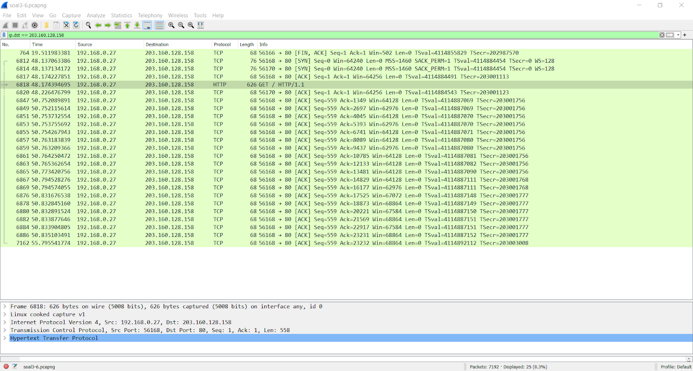
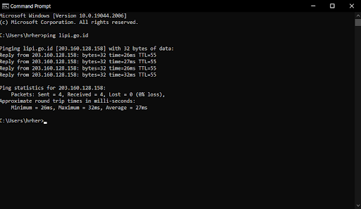
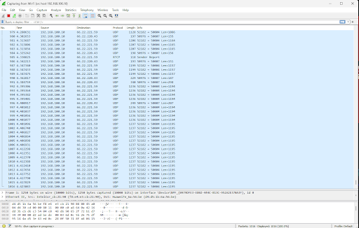
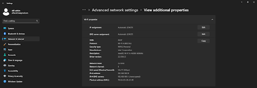
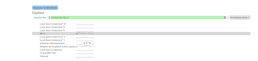
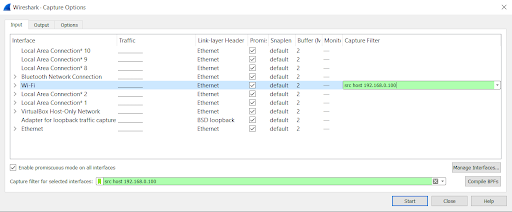

# Jarkom-Modul-1-C07-2022

laporan resmi Praktikum Jaringan Komputer Modul 1 tahun 2022

Anggota Kelompok C07 :
* 5025201274 - Alif Adrian Anzary
* 5025201122 - Marsyavero Charisyah Putra
* 5025201209 - Hemakesha Ramadhani Heriqbaldi

## 1. Sebutkan web server yang digunakan pada "monta.if.its.ac.id"! 
Server : nginx 1.10.3  
display filter : http.host contains monta.if.its.ac.id  
Penjelasan :  
Menggunakan display filter : http.host contains monta.if.its.ac.id  
Hasil :  

 Hasil Follow HTTP Stream : 

 

## 2. Ishaq sedang bingung mencari topik ta untuk semester ini , lalu ia datang ke website monta dan menemukan detail topik pada website “monta.if.its.ac.id” , judul TA apa yang dibuka oleh ishaq ?

 Penjelasan :
 Menggunakan display filter : http contains topik

 Meng-export file 194 karena memiliki path /topik/detailTopik/194 

 Menjalankan file 194.html dan akan menampilkan page Detail Topik yang dibuka Ishaq 

## 3. Filter sehingga wireshark hanya menampilkan paket yang menuju port 80!
display filter: tcp.dstport == 80 || udp.dstport == 800 

 
Penjelasan:  
Menggunakan display filter : tcp.dstport == 80 || udp.dstport == 800  
Untuk menampilkan paket yang menuju port 80

## 4. Filter sehingga wireshark hanya mengambil paket yang berasal dari port 21!
Display filter : tcp.srcport == 21

Penjelasan:  
Menggunakan display filter: tcp.srcport == 21  
Untuk mengambil paket yang berasal dari port 21

## 5. Filter sehingga wireshark hanya mengambil paket yang berasal dari port 443!

Penjelasan :
 
Menggunakan display filter : tcp.srcport == 443

## 6. Filter sehingga wireshark hanya menampilkan paket yang menuju ke lipi.go.id !

Penjelasan :
 
Mengambil ip dari website lipi.go.id menggunakan ping di dalam cmd

Lalu menggunakan ip address website lipi.go.id (203.160.128.158) untuk display filter : ip.dst == 203.160.128.158

## 7. Filter sehingga wireshark hanya mengambil paket yang berasal dari ip kalian!

Penjelasan :
 
Penjelasan:
Mendapatkan Ip address pribadi dengan :
Membuka Settings -> Network & Internet -> WIFI -> pilih network WIFI yang telah terkoneksi -> properties -> Ip address tertulis di sebelah IPv4 Address. Setelah mendapatkan IP Address, IP address digunakan sebagai capture filter dengan syntax : Src host [IP Address pribadi]

## 8. Telusuri aliran paket dalam file .pcap yang diberikan, cari informasi berguna berupa percakapan antara dua mahasiswa terkait tindakan kecurangan pada kegiatan praktikum. Percakapan tersebut dilaporkan menggunakan protokol jaringan dengan tingkat keandalan yang tinggi dalam pertukaran datanya sehingga kalian perlu menerapkan filter dengan protokol yang tersebut.
Jawaban:

Penjelasan:
 Cari dulu file dengan ip.addr == 127.0.0.1, lalu di TCP Stream salah satu paket. Untuk total chattingan yang dilakukan terdapat 3 chattingan yang ditemukan untuk tiap stream pada beberapa paket yang berbeda.
## 9. Terdapat laporan adanya pertukaran file yang dilakukan oleh kedua mahasiswa dalam percakapan yang diperoleh, carilah file yang dimaksud! Untuk memudahkan laporan kepada atasan, beri nama file yang ditemukan dengan format [nama_kelompok].des3 dan simpan output file dengan nama “flag.txt”.
## 10. Temukan password rahasia (flag) dari organisasi bawah tanah yang disebutkan di atas!
